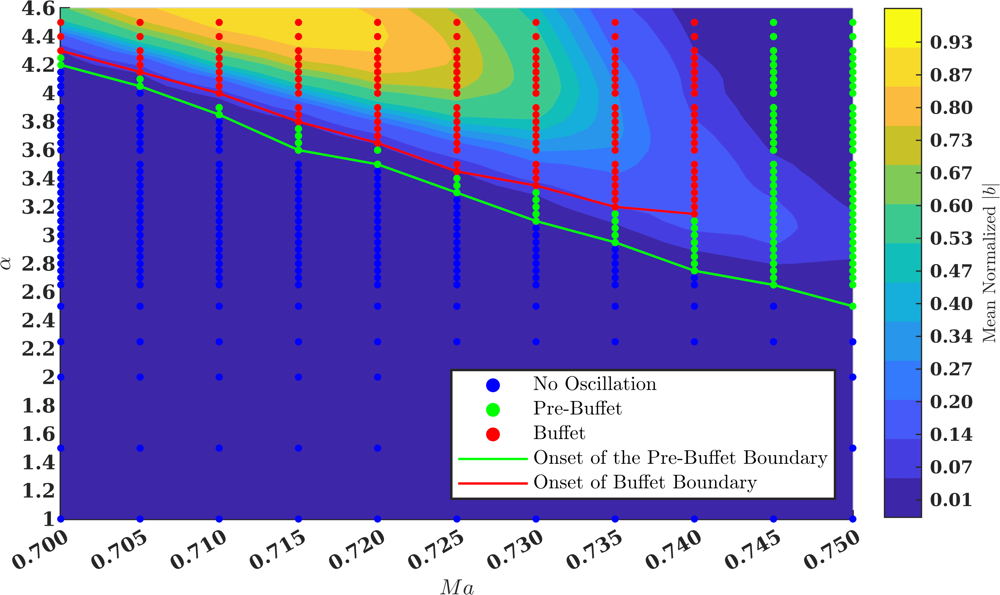

{}
This is a planned submission. For additional technical details, code, or requests, please contact the corresponding author.
{}

<!-- 
**Supplementary notes:**  
Add additional technical explanations, figures, or code snippets here. 
-->

